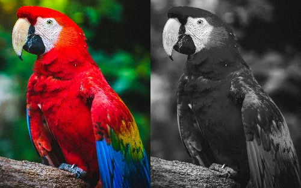
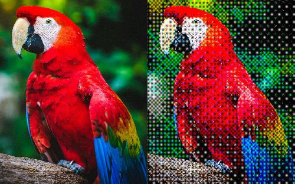
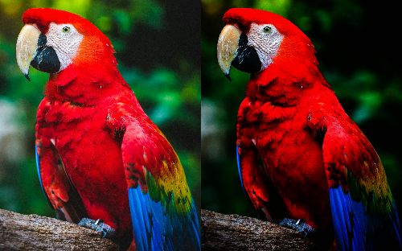
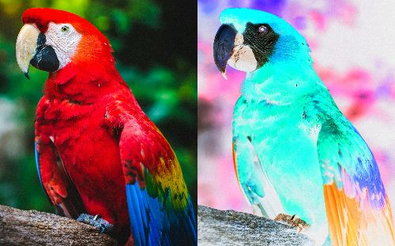

# Pixelate

[](./LICENSE)
[](https://github.com/rmuraix/pixelate/actions/workflows/build.yml)

## About

Command line applications for image processing

## Usage

Click [here](https://github.com/image-rs/image#supported-image-formats) to see supported image formats.

```bash
Usage: pixelate --input <FILE> --output <FILE> <COMMAND>

Commands:
  grayscale  Convert the image to grayscale
  halftone   Apply halftoning using the dithering method
  gamma      Perform gamma correction
  invert     Apply negative-positive inversion
  help       Print this message or the help of the given subcommand(s)

Options:
  -i, --input <FILE>   Path to the image file to be processed
  -o, --output <FILE>  Output path for the processed image file
  -h, --help           Print help
  -V, --version        Print version
```

### Grayscale

```bash
Usage: pixelate --input <FILE> --output <FILE> grayscale [OPTIONS]

Options:
  -r, --red <RED>      Red channel weight [default: 0.2126]
  -g, --green <GREEN>  Green channel weight [default: 0.7152]
  -b, --blue <BLUE>    Blue channel weight [default: 0.0722]
  -h, --help           Print help
```

#### Example



### Halftone

```bash
Usage: pixelate --input <FILE> --output <FILE> halftone

Options:
  -h, --help  Print help
```

#### Example

Produces black-and-white (grayscale) ordered-dither output.



### Gamma

```bash
Usage: pixelate --input <FILE> --output <FILE> gamma --gamma <GAMMA>

Options:
  -g, --gamma <GAMMA>  Gamma value
  -h, --help           Print help
```

#### Example

`gamma=0.45`



### Invert

```bash
Usage: pixelate --input <FILE> --output <FILE> invert

Options:
  -h, --help  Print help
```

#### Example



## Development

- Build: `cargo build` (release: `cargo build --release`)
- Test: `cargo test`
- Format: `cargo fmt --all` (CI enforces `-- --check`)
- Lint: `cargo clippy --all-targets --all-features -- -D warnings`

## Library Usage

You can use Pixelate as a library. Example (apply halftone):

```rust
use image::GenericImageView;
use pixelate::filters::{Filter, HalftoneFilter};

let img = image::open("input.jpg")?.to_rgb8();
let out = HalftoneFilter.apply(&img);
out.save("out.jpg")?;
```

## Contributing

Your contribution is always welcome. Please read [Contributing Guide](https://github.com/rmuraix/.github/blob/main/.github/CONTRIBUTING.md).
