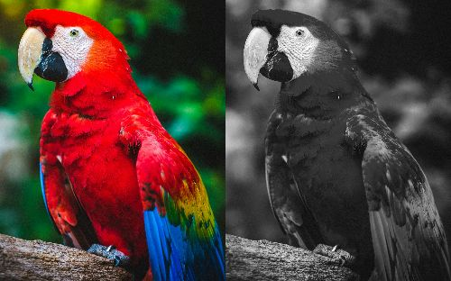
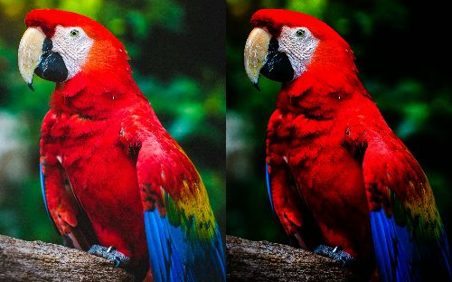
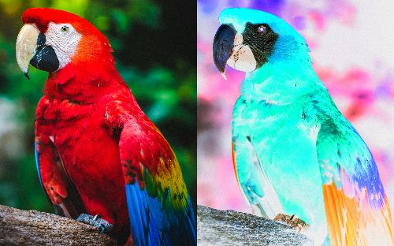

# Commands

This document provides detailed usage examples for each command supported by Pixelate.

## Grayscale

Convert the image to grayscale.

```bash
Usage: pixelate --input <FILE> --output <FILE> grayscale [OPTIONS]

Options:
  -r, --red <RED>      Red channel weight [default: 0.2126]
  -g, --green <GREEN>  Green channel weight [default: 0.7152]
  -b, --blue <BLUE>    Blue channel weight [default: 0.0722]
  -h, --help           Print help
```

### Example



## Halftone

Apply halftoning using the dithering method.

```bash
Usage: pixelate --input <FILE> --output <FILE> halftone

Options:
  -h, --help  Print help
```

### Example

Produces black-and-white (grayscale) ordered-dither output.


## Gamma

Perform gamma correction.

```bash
Usage: pixelate --input <FILE> --output <FILE> gamma --gamma <GAMMA>

Options:
  -g, --gamma <GAMMA>  Gamma value
  -h, --help           Print help
```

### Example

`gamma=0.45`



## Invert

Apply negative-positive inversion.

```bash
Usage: pixelate --input <FILE> --output <FILE> invert

Options:
  -h, --help  Print help
```

### Example



## Edge

Detect edges (e.g., Sobel).

```bash
Usage: pixelate --input <FILE> --output <FILE> edge [OPTIONS]

Options:
      --method <METHOD>
          Edge detection method

          Possible values:
          - sobel: Sobel operator (gradient magnitude)
          
          [default: sobel]

      --intensity <INTENSITY>
          Intensity multiplier applied after normalization (>= 0.0)
          
          [default: 1.0]

  -h, --help
          Print help (see a summary with '-h')
```

### Example

`method=sobel intensity=2.0`


